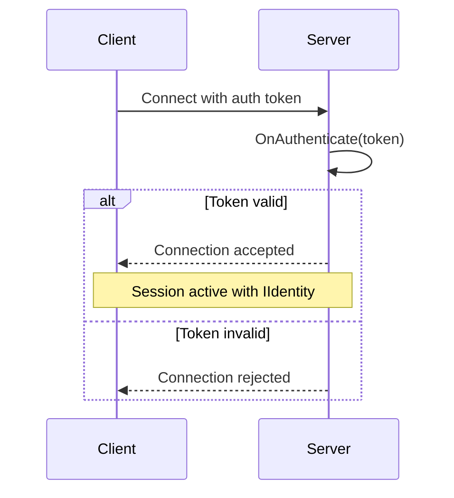

# Authentication

NexNet supports token-based authentication at the connection level. When enabled, clients must provide an authentication token during connection, and the server validates it before allowing the session to proceed.

## Enabling Authentication

Authentication is disabled by default for backward compatibility. Enable it on the server config:

```csharp
var serverConfig = new TcpServerConfig
{
    EndPoint = new IPEndPoint(IPAddress.Any, 5000),
    Authenticate = true
};
```

## Server-Side Validation

Override `OnAuthenticate` in your server nexus to validate client tokens. Return an `IIdentity` on success, or `null` to reject the connection:

```csharp
[Nexus<IServerNexus, IClientNexus>(NexusType = NexusType.Server)]
public partial class ServerNexus
{
    protected override ValueTask<IIdentity?> OnAuthenticate(ReadOnlyMemory<byte> authToken)
    {
        if (ValidateToken(authToken))
            return new ValueTask<IIdentity?>(new UserIdentity("username"));

        return new ValueTask<IIdentity?>((IIdentity?)null);
    }
}
```

The `IIdentity` returned by `OnAuthenticate` is available throughout the session via `Context.Identity`, which is used by the [Authorization](authorization.md) system for method-level access control.

## Client-Side Token

Provide the authentication token on the client config via the `Authenticate` delegate:

```csharp
var clientConfig = new TcpClientConfig
{
    EndPoint = new IPEndPoint(IPAddress.Loopback, 5000),
    Authenticate = () => Encoding.UTF8.GetBytes("my-auth-token")
};
```

The delegate is called each time the client connects (including reconnections), allowing you to refresh tokens as needed.

## Connection Flow



## See Also

- [Authorization](authorization.md) — Method-level access control using the authenticated identity
- [ASP.NET Integration](asp-net-integration.md) — Authentication via ASP.NET middleware and bearer tokens
