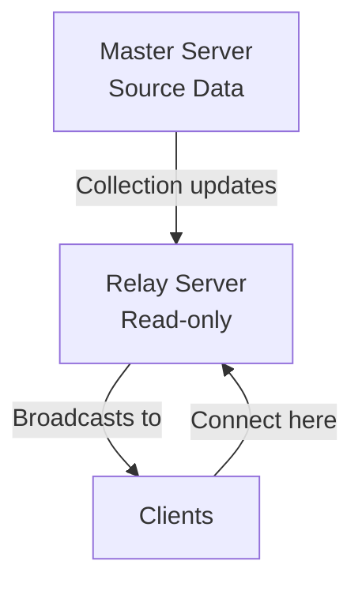

# Synchronized Collections

NexNet provides synchronized collections that keep data in sync between server and clients in real time. Collections are defined on the server nexus interface and accessed through the client proxy.

## Defining a Collection

Decorate collection properties on the server nexus interface with `[NexusCollection]`:

```csharp
public partial interface IClientNexus { }
public partial interface IServerNexus
{
    [NexusCollection(NexusCollectionMode.BiDirectional)]
    INexusList<int> IntList { get; }
}

[Nexus<IClientNexus, IServerNexus>(NexusType = NexusType.Client)]
public partial class ClientNexus { }

[Nexus<IServerNexus, IClientNexus>(NexusType = NexusType.Server)]
public partial class ServerNexus { }
```

Collections must be decorated with `NexusCollectionAttribute`, otherwise the server nexus will throw. Synchronized collections are only allowed on the server nexus.

## Collection Modes

| Mode | Description |
|------|-------------|
| `ServerToClient` | One-way sync from server to clients. Clients receive updates but cannot modify. |
| `BiDirectional` | Two-way sync. Changes from server or any client propagate to all participants. |
| `Relay` | Read-only collection that receives from a parent server and broadcasts to its own clients. |

## INexusList API

`INexusList<T>` provides a list-like API with mutations routed through the server. Mutation methods return `Task<bool>`, where the result indicates whether the server accepted or rejected the operation.

Available operations:
- `AddAsync` — Append an item
- `InsertAsync` — Insert at index
- `RemoveAsync` — Remove by value
- `RemoveAtAsync` — Remove at index
- `ClearAsync` — Remove all items
- `MoveAsync` — Move an item to a new index
- `ReplaceAsync` — Replace an item at index

## Connection Lifecycle

Collections support explicit lifecycle management through `EnableAsync()` and `DisableAsync()`, with tasks for monitoring state changes.

```csharp
var client = ClientNexus.CreateClient(clientConfig, new ClientNexus());
await client.ConnectAsync();

var list = client.Proxy.IntList;

// Subscribe to change events before enabling
list.Changed.Subscribe(args =>
{
    Console.WriteLine($"Collection changed: {args.ChangedAction}");
});

// Enable the collection connection (starts duplex pipe internally)
var enabled = await list.EnableAsync();

// Wait for initial sync to complete
await list.ReadyTask;

// Perform operations
await list.AddAsync(12345);
await list.InsertAsync(0, 99999);
Console.WriteLine($"Count: {list.Count}, First: {list[0]}");

// Monitor disconnection
_ = list.DisabledTask.ContinueWith(_ => Console.WriteLine("Collection disconnected"));

// Disable when done
await list.DisableAsync();
```

The convenience method `ConnectAsync()` combines `EnableAsync()` and waiting for `ReadyTask`:

```csharp
// Equivalent to: await EnableAsync(); await ReadyTask;
await client.Proxy.IntList.ConnectAsync();
```

## Collection States

Collections expose a `State` property of type `NexusCollectionState`:

| State | Description |
|-------|-------------|
| `Disconnected` | Not connected to the server |
| `Connecting` | Connection in progress |
| `Connected` | Connected and synchronized |

## Relay Mode

Relay collections enable hierarchical data distribution across multiple servers. A relay server connects to a parent collection (on a master server) and broadcasts changes to its own connected clients.



### Defining a Relay Collection

```csharp
// Shared interfaces
public interface IClientNexus { }

public interface IMasterServerNexus
{
    [NexusCollection(NexusCollectionMode.ServerToClient)]
    INexusList<GameState> GameStates { get; }
}

public interface IRelayServerNexus
{
    [NexusCollection(NexusCollectionMode.Relay)]
    INexusList<GameState> GameStates { get; }
}
```

### Configuring the Relay Server

The relay server uses a `NexusClientPool` to maintain connection to the master server:

```csharp
var masterClientConfig = new TcpClientConfig
{
    EndPoint = new IPEndPoint(IPAddress.Parse("10.0.0.1"), 5000)
};

var poolConfig = new NexusClientPoolConfig(masterClientConfig);
var masterPool = new NexusClientPool<MasterClientNexus, MasterClientNexus.ServerProxy>(poolConfig);

var relayServerConfig = new TcpServerConfig
{
    EndPoint = new IPEndPoint(IPAddress.Any, 5001)
};

var relayServer = RelayServerNexus.CreateServer(
    relayServerConfig,
    () => new RelayServerNexus(),
    configurer =>
    {
        var connector = masterPool.GetCollectionConnector(proxy => proxy.GameStates);
        configurer.Context.Collections.GameStates.ConfigureRelay(connector);
    }
);

await relayServer.StartAsync();
```

### Client Connection to Relay

Clients connect to the relay server exactly as they would to a master server:

```csharp
var client = ClientNexus.CreateClient(relayClientConfig, new ClientNexus());
await client.ConnectAsync();

await client.Proxy.GameStates.ConnectAsync();

foreach (var state in client.Proxy.GameStates)
{
    Console.WriteLine($"Game: {state.Name}");
}
```

### Relay Characteristics

- **Read-only**: Relay collections reject all client modification attempts
- **Auto-reconnect**: Automatically reconnects to the parent collection if disconnected
- **State synchronization**: Maintains full state sync with parent, including initial snapshot and incremental updates
- **Event propagation**: `Changed` events fire for both local subscribers and connected clients

### Monitoring Relay State

```csharp
var relay = relayServer.Collections.GameStates;

// Wait for connection to master
await relay.ReadyTask;
Console.WriteLine("Relay connected to master");

// Monitor disconnection
relay.DisconnectedTask.ContinueWith(_ =>
    Console.WriteLine("Lost connection to master, reconnecting...")
);
```

## See Also

- [Authorization](authorization.md) — Collection-level authorization with `[NexusAuthorize]`
- [Duplex Pipes](duplex-pipes.md) — Low-level byte streaming (collections use pipes internally)
